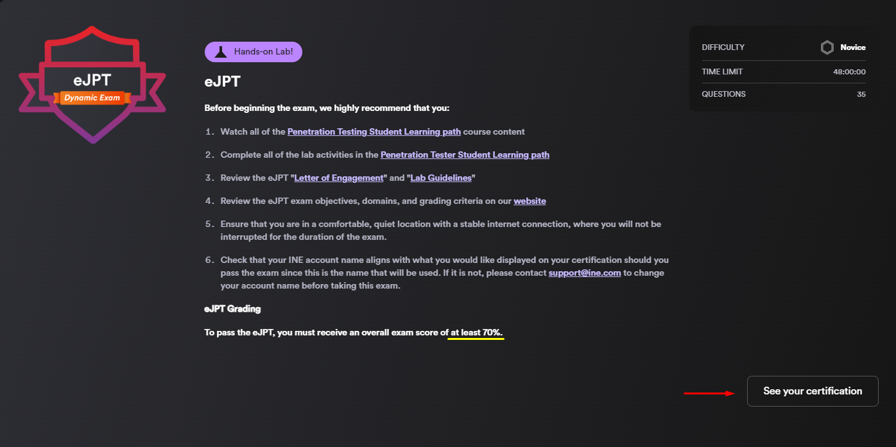

# eJPTv2

## المقدمة

لن أخوض كثيرا في تفاصيل آلية حساب نسبة النجاح وليس عليكم التركيز فيه أثناء رحلتكم للحصول على الشهادة يمكنكم النظر في قسم [المراجع ](./#almraja) في نهاية الصفحة ومعرفة تفاصيل حساب نسبة النجاح وتفاصيل أخرى ، وإنما ما سأقدمه هي نظرة عامة بطريقتي مع مصادر يمكنكم الاستفادة منها كمرجع للتعلم، ستجدون كل ما يخص المصادر التي ستفيدكم والأدوات المذكورة في الكورس في صفحة [<mark style="color:blue;">المصادر</mark>](info-and-resources.md)&#x20;

##

## سعر الاختبار والاشتراك&#x20;

سعر الاختبار مع المحتوى <mark style="color:red;">`249$`</mark>، حصلت على المحتوى ورخصة الاختبار في فبراير 2023 وفي ذلك الوقت كان هناك عرض بنفس هذا السعر وهي <mark style="color:blue;">رخصتان لدخول اختبارeJPT و ICCA مجانا متاحة لمدة 6 شهور بالاضافة اتاحة الوصول إلى  كورس PTS  وكورسات أخرى لمدة سنة</mark> ، فحصت موقعهم وأعتقد أن هذا العرض لم يعد موجودا  تماما وأصبح متضمنا مع سعر الاشتراك السنوي يمكنكم استعمال هذا الكود لخصم 29$ (<mark style="color:red;">`take10`</mark>)&#x20;

&#x20;

<figure><figcaption></figcaption></figure>

هذه صورة سعر الاختبار حاليا لوحده مع ثلاثة أشهر أشتراك مع رخصة الاختبار لمدة  سنة

<figure><figcaption></figcaption></figure>

## المحتوى&#x20;

مجموع عدد ساعات الكورس 148 ساعة مقسمة إلى أربعة أقسام&#x20;

1- <strong>Assessment Methodologies</strong>

يهتم هذا القسم بـ مجموعة متنوعة من عناصر اختبار الاختراق وتحديد endpoints على الشبكة ، وتحديد المنافذ و services المفتوحة على الهدف ، واستخراج المعلومات من المصادر العامة  ، وتحديد نقاط الضعف في services ، وتقييم المعلومات وأهمية أو تأثير الثغرات الأمنية.

الأقسام الفرعية:

* **Information Gathering**
* **Footprinting & Scanning**
* **Enumeration**
* **Vulnerability Assessment**

.png>)

2- <strong>Host &#x26; Networking Auditing</strong>

* **Auditing Fundamentals**

**ستتعرف على مواضيع  ومفاهيم نظرية مثل ماهو Auditing**&#x20;

* Compliance
* Frameworks and Maturity

ونبذة عن

Nessus nmap

3- <strong>Host &#x26; Network Penetration Testing</strong>

&#x20;هذا القسم من أهم الأقسام فيه ستتعلم تحديدالـVulnerabilities وتنفيذ الاستغلالات exploitation  بالـ Metasploit وتعديل السكريبتات ستتعلم أمور مثل:&#x20;

* &#x20;Pivoting via port forwarding&#x20;
* conduct brute-force password attacks
* hash cracking

وغيرها الكثير

الاقسام الفرعية

* **System/Host-Based Attacks**
* **Network-Based Attacks**
* **The Metasploit Framework (MSF)**
* **Exploitation**
* **Post-Exploitation**
* **Social Engineering**

.png>)

4-<strong>Web Application Penetration Testing</strong>

* **Introduction to the Web and HTTP Protocol**

يهتم بجانب الويب ويمر على ثغرات مثل XSS ,SQL Injuction  باستخدام ادوات مختلفة

.png>)

المواضيع التي كان المسؤول عن شرحها `Alexis Ahmed`  هي التي أقيمها تقيما عاليًا لا يكتفي فقط بشرح خطوات الابات والمفاهيم حرفيا وإنما يضع نصب عينك طرقا مختلفة في تنفيذها يمكنكم الإطلاع على قناة [HackerSploit](https://www.youtube.com/@HackerSploit) على اليوتيوب لمعرفة  أسلوبه  ، أما المواضيع التي شرحها `Josh Mason` مملة وتقيمي إليه سيء ودايما سكيب

على أي حال `Alexis Ahmed` ماسك أهم المواضيع  الرئيسية  وإنما المواضيع الاخرى التي شرحها `Josh` فالانترنت بحر من المصادر للتعلم والاستغناء عنه إذ لم تصل لك المعلومة بالشكل الكافي&#x20;

## الاختبار&#x20;

الاختبار عبارة عن `35 سؤال`  ودرجة النجاح `لا تقل عن 70%` ، تتنوع الأسئلة بين اختيار من متعدد أو كتابة كلمة مرور أو إيجاد Flags والاختيار من متعدد هو الأكثر، `مدة الاختبار 48 ساعة` وهي كافية جدًا، أما عن مستوى الاختبار من وجهة نظري فهو ليس بتلك الصعوبة بالنظر لضخامة المحتوى، وإنما يعتمد كثيرا على قدرتك على تنفيذ مراحل اختبار الاختراق والتجربة مثلا ستجد أن احد الأسئلة تقول لك ما لخدمة التي تقدمها شركة الموقع X  أو في أي ساعة تم إنشاء الموقع ، ولإجابة هذا النوع من الأسئلة البسيطة جدا يعتمد على قدرتك على البحث.

### طريقة الاختبار &#x20;

الاختبار سيكون عملي من خلال لاب افتراضي Virtual lab بدون الحاجة إلى VPN للإتصال أي أنني مقيدة بالأدوات المحملة والجاهزة لديهم وكنت اتمنى الحقيقة منهم اضافة خيار الVPN.

في أسفل محتوى الكورس ستجد مكان بداية الاختبار "Start Exam"  ولكن لإنني حصلت على الشهادة فتغير الأسم

<figure><figcaption></figcaption></figure>

`يبدأ الاختبار` بالتأكيد بفحص الشبكة وايجاد الاجهزة ستجد أن هناك عدد أجهزة معينة أما عن ترتيب الأسئلة فلا يوجد ترتيب ، فعندما تخترق server 1 ستجد أن هناك اسئلة متعلقة به متفرقة بين الـ 35 سؤالا ، ويوجد تتابع مثلا سؤال 2 متعلق بواحد ،  فأنصح دوما بتدوين الملاحظات والتحقق  وهذه كانت طريقتي في التدوين باستخدام notion

<figure><figcaption></figcaption></figure>

### هل الاختبار مثل لابات المحتوى ؟

&#x20;بالتأكيد أغلب الأمور التي ستتعلمها من تكنيك ومفاهيم وغيرها وأيضا يوجد أنواع ثغرات في الاختبار لم تمر عليك خلال المحتوى، ومن الواضح أن الهدف هو أن تطبق مراحل اختبار الاختراق   ، فعلى سبيل المثال ففي المحتوى ستجد انك تعلمت ftp  برقم  version معين ، ولكن في الاختبار لن يكون نفس version ، ستكون هناك بورتات مفتوحة والـversion المستخدم نفس الابات، من خلال هذا الأمر يمكنك استخدام أكثر من طريقة للوصول للنظام وستجد أن الأمر ممتع لذا لا داعي للقلق ،

### **هل واجهت مشكلة في لاب الاختبار الافتراضي؟**

لا لم أواجه مشاكل كبيرة ولكن المشكلة الوحيدة التي واجهتها هو الشعور بالتقييد وعدم استخدام اساليب مختلفة خارجة عن الأدوات المحملة في لاب الاختبار ، فلا يُسمح بتنزيل أدوات غير موجودة، فلا تتفاجأ إن لم تعمل أدوات مثل (`gobuster`, `dirbuster`)وهنا تبدأ عملية البحث وتجربة عن بدائل وأنصح أيضا بتجربتة wordlists مختلفة  خلال عملية Brute force . &#x20;

### ملاحظة مهمة&#x20;

<figure><figcaption></figcaption></figure>

هذه الامور التي ستقيم عليها للنجاح أي يبدو أن الاختبار وجميع حركاتك داخل الاختبار مسجلة مع الاجابة على الأسئلة فعلى سبيل المثال لم يكن هناك سؤال متعلق بـ نقل الملفات ولكنه موجود كتقييم.

أو حتى إجراء Brute-force login attack

## الفرق بين eJPTv1 and eJPTv2

لم أجرب اختبار النسخة الأولى لأقيم الفرق ولكن تقيمي أن هناك فرقا كبيرا في المحتوى بل أصبح أفضل  .

<table><thead><tr><th width="244.33333333333331">eJPTv1</th><th>eJPTv2</th><th>.</th></tr></thead><tbody><tr><td>20</td><td>35</td><td>عدد الأسئلة</td></tr><tr><td>3</td><td>2</td><td>عدد أيام الاختبار</td></tr><tr><td>75%</td><td>70%</td><td>نسبة النجاح</td></tr><tr><td>VPN</td><td>Virtual lab</td><td>طريقة الاختبار</td></tr></tbody></table>

##

## تجربتي&#x20;

المحتوى كبداية لا يناسب المستوى التأسيسي الصفري، مثلما عُرف عن eJPTv1 في النسخة الاولى، يجب على المقبل للمادة أن يملك خلفية اساسية في الشبكات والتعامل نظام لينكس وأضيف أيضا معرفة في الويب  لكي لا تكون وتيرة تعلمه بطيئة ،  اما عن خلفيتي فأنا أملك كل ذلك ولم أواجه صعوبة في الفهم أو التعامل ولم يستغرق مني المحتوى سوى شهرين و وبضعة ايام على فترات متقطعة  ،واستغرقت أقل من 15 ساعة للإنتهاء من الاختبار.&#x20;

&#x20;

## الختام

في الختام أوجه لكم بعض النصائح أثناء الاختبار وأهمها الهدوء والتوكل على الله  &#x20;


ربما ستواجه صعوبة في أحد الـ Targets  لعمل privilege escalation ولكن تذكر أن الحل بسيط حاول  الدخول للسيرفر واكتشاف المستخدمين في النظام ، فتش عن الصلاحيات لكل مستخدم  ثم حاول إيجاد كلمة المرور لأحد المستخدمين أو ببساطة ايجاد تكنيك أخر.  &#x20;



دون الملاحظات دائما ، ولا تنس Brute force    &#x20;


## Whoami&#x20;

I have a Bachelor's degree in Computer Science and an interest in cybersecurity. I hold certifications in Security+ and eJPTv2. With a solid background in networks and operating systems, along with previous experience in Capture the Flag (CTF) competitions.

Twitter: [@sama\_almeh7](https://twitter.com/sama\_alme7/)   Linkedin: [sama](https://www.linkedin.com/in/sama-almehmadi-/)

## المراجع

* [Osama eJPTv2](https://caramel.la/oathmastery/oEfSC2mBD/mraja-h-ikhtbar-ejptv2-w-mhtwa-ptsv2)
* [eJPTv2 ine](https://ine.com/learning/certifications/internal/elearnsecurity-junior-penetration-tester-cert)

